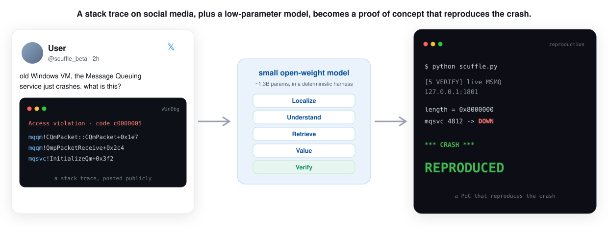
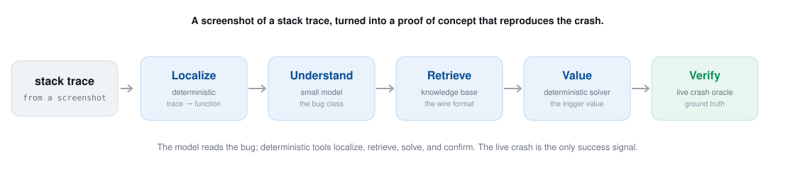

<p align="center">
  
</p>

<p align="center"><b>Scuffle.</b> A screenshot of a crash stack trace goes in. A working proof of concept that reproduces the crash comes out.</p>

<p align="center">
  
  
  
  
  
</p>

<p align="center">
  <a href="#the-position">The position</a>
  &nbsp;&middot;&nbsp; <a href="#the-procedure-scoped-to-the-demo">The procedure</a>
  &nbsp;&middot;&nbsp; <a href="#run-it">Run it</a>
  &nbsp;&middot;&nbsp; <a href="demo/">The demo</a>
</p>

<p align="center"><i>Position paper. The runnable proof lives in <a href="demo/"><code>demo/</code></a>; this document is the argument.</i></p>

---

Someone posts a screenshot. A service crashed, here is the trace, anyone know what this is.
Thousands scroll past. A handful of experts could, given days, turn it into a working
reproduction. Almost none do, because that expert time is scarce and expensive.

## The position

A crash **stack trace** is a certificate that a bug exists and a partial address for where it
lives. It names the faulting function and the exception. Combined with the crashing module's own
shipped code and a small amount of protocol knowledge, it reduces the search for an input that
reproduces the crash from astronomically large to small. What has stood between that certificate
and a working proof of concept is not a missing capability. It is the labor of composing
capabilities that already exist: reading disassembly, recognizing a bug class, recalling a wire
format, solving for a value, and driving a live target until it dies.

We argue that this composition can be **mechanized**, and that it does not require a frontier
model. It requires a **low-parameter language model for the single step that is a judgment about
meaning**, the class of the bug, and **deterministic tools for every step that must be exact**,
bound to a single hard signal: the target process actually crashing. This reframes the unit of
crash analysis. For decades it has been (crash report, analyst hours). We argue it should be
(stack trace, reproducing proof of concept), produced automatically. The claim is not a better
fuzzer and not a new vulnerability. It is that the path from a public crash screenshot to a
confirmed reproduction is a pipeline of established results that has simply never been assembled
and pointed at that input.

The rest of this document is that argument, and then the procedure scoped to a real, patched
Microsoft CVE that the [demo](demo/) reproduces end to end.

## Two established results

**A crashing input can be automatically transformed into more than a crash.** Automatic exploit
generation takes a program and produces control-flow-hijacking inputs without a human in the loop
(Avgerinos et al., 2011), operates directly on binaries at scale (Cha et al., 2012), and turns a
proof-of-concept crash into an exploit (Heelan, 2009; Wu et al., 2018), including modular, greybox
generation against real heap corruption (Heelan et al., 2019). The machinery to go from "it
crashes here" to "here is an input that drives it" is mature. Every one of these systems, however,
hard-codes the one step that is a judgment: *what kind of bug this is*, which determines how to
push on it.

**A model reading code forms a semantic representation of it, including the class of its defects.**
Neural models reason about program behavior from structure without executing anything (Allamanis
et al., 2018). The signal survives compilation and stripping: cross-platform binary similarity
(Xu et al., 2017) and self-supervised assembly embeddings (Li et al., 2021) read meaning off
machine code with no source, and current models decompile binaries into faithful pseudocode
directly (Tan et al., 2024). Classifying the *type* of a vulnerability, its CWE class rather than
its mere presence, is established prior art (Zou et al., 2021).

These are usually studied apart. Put together they close a loop: the semantic judgment that
exploit-generation systems hard-code, "this is a length-driven out-of-bounds write," is exactly
what a model produces when it reads the crashing function, and everything downstream of that
judgment already exists as deterministic machinery.

## A stack trace localizes the fault and bounds the search

A stack trace names the faulting function, which fixes the bug to a specific location.
Crash-report triage at scale reverse-executes from a partial dump and a stack to assign blame to
the correct frame (Cui et al., 2016), evidence that a stack trace alone localizes a fault reliably
enough to act on. Given the faulting function, finding an input that reaches and triggers it is a
directed search, and directed search is well studied: under-constrained symbolic execution checks
a single function in isolation for the conditions that fault it (Ramos & Engler, 2015), and
directed greybox fuzzing drives execution toward a chosen target site rather than exploring blindly
(Böhme et al., 2017). The trace converts an unbounded search over all inputs into a bounded search
toward one named location, which is why the screenshot is enough to start from.

## The model classifies; deterministic tools compute

The division of labor is forced by what models are reliable at. Transformers degrade sharply on
compositional and multi-step arithmetic, which is the kind of exact computation a trigger value
requires (Dziri et al., 2023). The established remedy is **delegation**: the model decides *what*
to compute and hands the computation to a deterministic tool it invokes. Program-aided language
models offload each
arithmetic step to an interpreter (Gao et al., 2023), and tool-augmented models learn to call
external routines for the parts they cannot do internally (Schick et al., 2023).

Scuffle applies this line precisely. The model is asked for the bug class, a judgment about
meaning, and nothing else. The exact trigger value is read out of the binary by a deterministic
solver: it recovers the size formula from the disassembly, a sign-extend followed by a multiply,
and computes the regime that overflows it. The model never guesses the number, because a model
guessing the number is the known failure mode, and the tool that computes it is the known fix.

## Success is a live crash, not a heuristic

Softer success signals are unreliable. Heuristic "exploitability" verdicts are proxies, and the
methodology of the field requires claims to be grounded in observed crashes rather than proxies,
because the proxies do not hold up (Klees et al., 2018). Sanitizers that turn latent out-of-bounds
accesses into immediate faults (Serebryany et al., 2012) made memory corruption reliably
observable by converting a fuzzy question into a definite one. Scuffle uses the strongest form of
that signal: the target service going down, detected by its process identifier changing or
disappearing. This gives ground truth with no false positives.

Anchoring the pipeline to that one signal lets the upstream stages run fast and approximate. If
the model's class or the solver's band is wrong, the oracle reports "still alive," and the search
continues. The cost of a wrong guess is a wasted send, not a false claim of success.

## Candidates are filtered by the live oracle

When a checker is cheap, the reliable way to use a language model is to have it generate candidates
and keep only the ones that pass the check. Sampling many candidate programs and filtering them by
executing tests is what lifts code models to competition-level performance (Chen et al., 2021; Li
et al., 2022); the model supplies breadth, an executable oracle supplies correctness. Scuffle
applies this pattern to crash reproduction. The model and the solver generate a candidate trigger;
the live-crash oracle filters it. Because only a real crash passes, the errors of a small model
upstream do not propagate to the output; they are absorbed by the search.

## The input can be a screenshot

The input need not be a well-formed bug report. Public language and artifacts
about vulnerabilities carry recoverable, exploit-predictive signal: mining public posts predicts
which vulnerabilities will be exploited (Sabottke et al., 2015), often before an official score
exists (Chen et al., 2019), and technical write-ups around a disclosure sharpen that prediction
(Suciu et al., 2022). A screenshot of a stack trace is a dense instance of exactly this signal. An
optical-character-recognition front end turns the image into the trace text, and the trace text is
the anchor of the first stage. The starting point is as informal as an image someone posted; the
endpoint is a confirmed reproduction.

## The procedure, scoped to the demo

<p align="center">
  
</p>

The worked example is Microsoft Message Queuing, the "QueueJumper" bug (CVE-2023-21554): a heap
out-of-bounds write in `mqqm.dll`, reached through an over-large SRMP `DataLength` in a crafted
message. The posted trace is the entire input:

```
mqsvc.exe   mqqm.dll!CQmPacket::CQmPacket   0xC0000005 (access violation)
```

**1. Localize (deterministic).** The trace names the crashing function, `CQmPacket::CQmPacket`.
Symbolicate the shipped `mqqm.dll`, resolve the name to an address, and extract that function's
bytes and the small per-section helper it calls. This is the code context stage 2 reads.

**2. Understand (small model).** The model reads that disassembly and states the bug class and
mechanism: an attacker-controlled length is sign-extended, used to size a buffer, and then written
past. This is the one step that genuinely requires a model, a judgment about behavior invariant to
how the code is written (Allamanis et al., 2018; Zou et al., 2021). It yields a class, never a
number.

**3. Retrieve (knowledge base).** A small model does not carry MSMQ's wire format and must not
invent one. A compact, auditable knowledge base keyed by the crashing module returns what the
model lacks: the transport (TCP/1801), the message layout, the two session frames needed to reach
the vulnerable code (`establish_connection`, then `connection_parameters`), and the offsets where
`DataLength` lives.

**4. Value (deterministic solver).** The exact trigger value, read from the binary rather than
guessed. The solver recovers the size formula from the disassembly, `size = k*(sign_extend(len)+c)`,
and sweeps the regime it implies: the positive 32-bit band where the allocation is large but still
succeeds, so the out-of-bounds write faults instead of failing the allocation (Gao et al., 2023;
Ramos & Engler, 2015).

**5. Verify (live oracle).** Construct the message with the solved value, send the full session in
order to the running service, and watch its process identifier. Success is the service crashing,
nothing softer (Klees et al., 2018). This is where the loop closes.

## Why a small model is enough

The model is asked for one thing, the bug class, from code it can read. That is a small,
well-posed classification, not open-ended reasoning, and it is squarely inside what a
low-parameter open-weight model does reliably; data quality substitutes for scale in exactly this
regime (Gunasekar et al., 2023; Abdin et al., 2024). Everything the model is unreliable at, the
exact address, the exact value, the yes-or-no of success, has been removed from its job and handed
to deterministic tools. This is what makes the approach cheap and repeatable rather than a one-off
demonstration: it does not depend on the largest available model, or on any single vendor's model,
and it can run at the rate that public crash screenshots actually appear.

## The position, restated

The components are all established and have not been combined. A crashing input can be
automatically transformed toward an exploit. A model reading code produces the class of the defect
without running it. A stack trace localizes the fault and turns an unbounded search into a directed
one. Exact computation, where models fail, is delegated to deterministic tools they invoke. A live
crash is an unambiguous oracle, and filtering candidates through it keeps a small model's errors
from reaching the output. Each of these is a mature line of work. Composing them and binding them
to the oracle turns a screenshot of a stack trace into a proof of concept that reproduces the
crash, mechanically and at a cost that scales.

---

## Run it

Windows 11, as Administrator, in an isolated VM. **Safe by construction:** CVE-2023-21554 was
patched in April 2023; the demo runs a deliberately down-level `mqqm.dll` (10.0.22621.963) in
isolation, so it is a repeatable reproduction of a fixed bug, not a live 0-day.

```powershell
git clone https://github.com/calysteon/Scuffle-Beta
cd Scuffle-Beta/demo

python setup/fetch_vuln_mqqm.py mqqm_vuln.dll                                   # target binary, from MS symbol server
powershell -ExecutionPolicy Bypass -File setup/install_and_swap.ps1 -VulnDll mqqm_vuln.dll
python scuffle.py                                                               # stack trace in, live crash out
```

```
[INPUT]      mqsvc.exe  mqqm.dll!CQmPacket::CQmPacket  0xC0000005
[1 LOCALIZE] crashing function: CQmPacket::CQmPacket  (from the trace)
[2 UNDERSTAND] bug class: heap out-of-bounds write, length-field driven
[3 RETRIEVE] MSMQ over TCP/1801; message template + length field @ ['0xf4', '0xf8']; 2 session frames
[4 VALUE]    sweeping the overflow band: 15 candidates (0x8000000 .. 0x78000000)
[5 VERIFY]   firing at live MSMQ on 127.0.0.1:1801 (oracle = ground truth)
   length=  0x8000000   mqsvc 4812 -> DOWN   *** CRASH ***
RESULT: REPRODUCED. A screenshot of a stack trace became a PoC that crashes MSMQ.
```

## What is here

| | |
|---|---|
| [`demo/`](demo/) | the runnable worked example: orchestrator, oracle, constructor, setup, knowledge base |
| [`demo/scuffle.py`](demo/scuffle.py) | the five stages on one trace, driving the local reproduction |
| [`assets/`](assets/) | the hero diagram, the sample post, the pipeline figure |

## Responsible use

This repository reproduces a **patched, publicly documented** vulnerability against a target you
stand up yourself, in isolation, for research and education. Do not run it against systems you do
not own or are not authorized to test, do not point it at production or patched hosts, and keep the
target on `127.0.0.1`. The contribution is the **method**, not this particular decade-old bug.

---

## References

Abdin, M., et al. (2024). *Phi-3 Technical Report: A Highly Capable Language Model Locally on Your Phone.* arXiv:2404.14219.
Allamanis, M., Brockschmidt, M., & Khademi, M. (2018). *Learning to Represent Programs with Graphs.* ICLR. arXiv:1711.00740.
Avgerinos, T., Cha, S. K., Hao, B. L. T., & Brumley, D. (2011). *AEG: Automatic Exploit Generation.* NDSS.
Böhme, M., Pham, V.-T., Nguyen, M.-D., & Roychoudhury, A. (2017). *Directed Greybox Fuzzing (AFLGo).* ACM CCS. DOI 10.1145/3133956.3134020.
Cha, S. K., Avgerinos, T., Rebert, A., & Brumley, D. (2012). *Unleashing Mayhem on Binary Code.* IEEE S&P. DOI 10.1109/SP.2012.31.
Chen, H., Liu, R., Park, N., & Subrahmanian, V. S. (2019). *Using Twitter to Predict When Vulnerabilities will be Exploited.* KDD. DOI 10.1145/3292500.3330742.
Chen, M., et al. (2021). *Evaluating Large Language Models Trained on Code (Codex).* arXiv:2107.03374.
Cui, W., Peinado, M., Cha, S. K., Fratantonio, Y., & Kemerlis, V. P. (2016). *RETracer: Triaging Crashes by Reverse Execution from Partial Memory Dumps.* ICSE. DOI 10.1145/2884781.2884844.
Dziri, N., et al. (2023). *Faith and Fate: Limits of Transformers on Compositionality.* NeurIPS. arXiv:2305.18654.
Gao, L., Madaan, A., Zhou, S., Alon, U., Liu, P., Yang, Y., Callan, J., & Neubig, G. (2023). *PAL: Program-Aided Language Models.* ICML. arXiv:2211.10435.
Gunasekar, S., et al. (2023). *Textbooks Are All You Need (phi-1).* arXiv:2306.11644.
Heelan, S. (2009). *Automatic Generation of Control Flow Hijacking Exploits for Software Vulnerabilities.* MSc thesis, University of Oxford.
Heelan, S., Melham, T., & Kroening, D. (2019). *Gollum: Modular and Greybox Exploit Generation for Heap Overflows in Interpreters.* ACM CCS. DOI 10.1145/3319535.3354224.
Klees, G., Ruef, A., Cooper, B., Wei, S., & Hicks, M. (2018). *Evaluating Fuzz Testing.* ACM CCS. DOI 10.1145/3243734.3243804.
Li, X., Qu, Y., & Yin, H. (2021). *PalmTree: Learning an Assembly Language Model for Instruction Embedding.* ACM CCS. arXiv:2103.03809.
Li, Y., et al. (2022). *Competition-Level Code Generation with AlphaCode.* Science 378(6624). DOI 10.1126/science.abq1158.
Ramos, D. A., & Engler, D. (2015). *Under-Constrained Symbolic Execution: Correctness Checking for Real Code (UC-KLEE).* USENIX Security.
Sabottke, C., Suciu, O., & Dumitraș, T. (2015). *Vulnerability Disclosure in the Age of Social Media: Exploiting Twitter for Predicting Real-World Exploits.* USENIX Security.
Schick, T., Dwivedi-Yu, J., Dessì, R., Raileanu, R., Lomeli, M., Zettlemoyer, L., Cancedda, N., & Scialom, T. (2023). *Toolformer: Language Models Can Teach Themselves to Use Tools.* NeurIPS. arXiv:2302.04761.
Serebryany, K., Bruening, D., Potapenko, A., & Vyukov, D. (2012). *AddressSanitizer: A Fast Address Sanity Checker.* USENIX ATC.
Suciu, O., Nelson, C., Lyu, Z., Bao, T., & Dumitraș, T. (2022). *Expected Exploitability: Predicting the Development of Functional Vulnerability Exploits.* USENIX Security. arXiv:2102.07869.
Tan, H., Luo, Q., Li, J., & Zhang, Y. (2024). *LLM4Decompile: Decompiling Binary Code with Large Language Models.* EMNLP. arXiv:2403.05286.
Wu, W., Chen, Y., Xu, J., Xing, X., Gong, X., & Zou, W. (2018). *Revery: From Proof-of-Concept to Exploitable.* ACM CCS. DOI 10.1145/3243734.3243847.
Xu, X., Liu, C., Feng, Q., Yin, H., Song, L., & Song, D. (2017). *Neural Network-based Graph Embedding for Cross-Platform Binary Code Similarity Detection (Gemini).* ACM CCS. arXiv:1708.06525.
Zou, D., Wang, S., Xu, S., Li, Z., & Jin, H. (2021). *μVulDeePecker: A Deep Learning-Based System for Multiclass Vulnerability Detection.* IEEE TDSC. DOI 10.1109/TDSC.2019.2942930.
